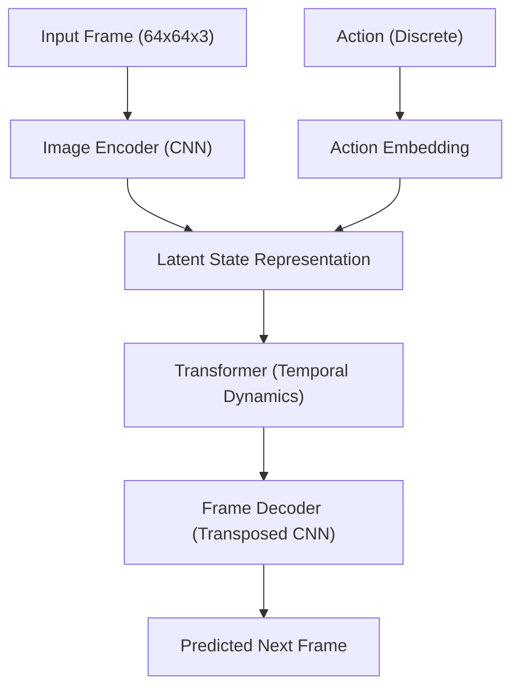

# Mini-Genie: An Action-Conditioned World Model

## 📌 Overview
**Mini-Genie** is a deep learning project inspired by Google DeepMind's groundbreaking work on generative interactive environments.  
It implements a **foundational world model** that learns the dynamics of an environment to **predict future frames** based on the current state and a given action.

Built with **PyTorch**, Mini-Genie uses a **CNN-Transformer architecture** to process visual information and model temporal relationships.  
This project serves as a hands-on exploration into **world models** and **action-conditioned video prediction**.

---

## 🧠 Model Architecture
The model is composed of several key modules that work together to predict the next frame.



### 1. **ImageEncoder**

A **Convolutional Neural Network (CNN)** that processes the input frame `(64x64x3)`.
It downsamples through a series of convolutional layers to extract a **high-level latent representation** of the state, which is then converted into a sequence of tokens for the Transformer.

### 2. **ActionEmbedding**

Converts discrete actions (e.g., `turn_left`, `move_forward`) into **dense vector embeddings**.
The action vector is concatenated with the image tokens before being passed to the Transformer.

### 3. **Transformer**

The **core temporal reasoning module**.
It models how the given action transforms the current state into the next state using **self-attention** and **positional embeddings**.

### 4. **FrameDecoder**

A **transposed convolutional network** that reconstructs the predicted next frame from the transformed latent representation.

### 5. **MiniGenie**

The main class that:

1. Passes the initial frame & action to the encoder and action embedding.
2. Processes the combined tokens with the Transformer.
3. Decodes the predicted frame with the FrameDecoder.

---

## 📊 Results & Evaluation

The model was trained on `(initial_frame, action, next_frame)` tuples and evaluated on a held-out test set.

**Performance Metrics:**

* **Mean Squared Error (MSE):** `0.000447`
* **Mean Absolute Error (MAE):** `0.001996`
* **Peak Signal-to-Noise Ratio (PSNR):** `33.50 dB`

Below is a side-by-side comparison between **actual** and **predicted** frames (64×64 resolution — hence a bit pixelated 😅):

---

## ⚙️ Setup and Usage

### 1. **Prerequisites**

Ensure you have **Python 3** installed.
Install dependencies:

```bash
pip install -r requirements.txt
```

**requirements.txt**

```
torch
torchvision
numpy
matplotlib
tqdm
gymnasium
minigrid
opencv-python
Pillow
```

---

### 2. **Dataset**

The model expects:

* `images.npy` — Initial frames
* `actions.npy` — Actions taken
* `next_frames.npy` — Ground-truth next frames

Place these in the `data/` folder.

---

### 3. **Training**

Run `mini-genie.ipynb` and:

1. Load and split the dataset.
2. Initialize **MiniGenie**, loss function, and optimizer.
3. Train for chosen epochs.
4. Save best weights to `mini-genie.pth`.

---

### 4. **Evaluation**

To evaluate:

1. Load `mini-genie.pth`.
2. Compute **MSE**, **MAE**, and **PSNR** on test set.
3. Generate visualizations (`model_evaluation_grid.png`).

---

## 🚀 Future Work

* **Bigger datasets** for better generalization.
* **Higher resolution** predictions.
* **Interactive simulation** where the model’s outputs feed back into itself.

---

## 📜 License

Licensed under the **MIT License**.
See [LICENSE](LICENSE) for details.


